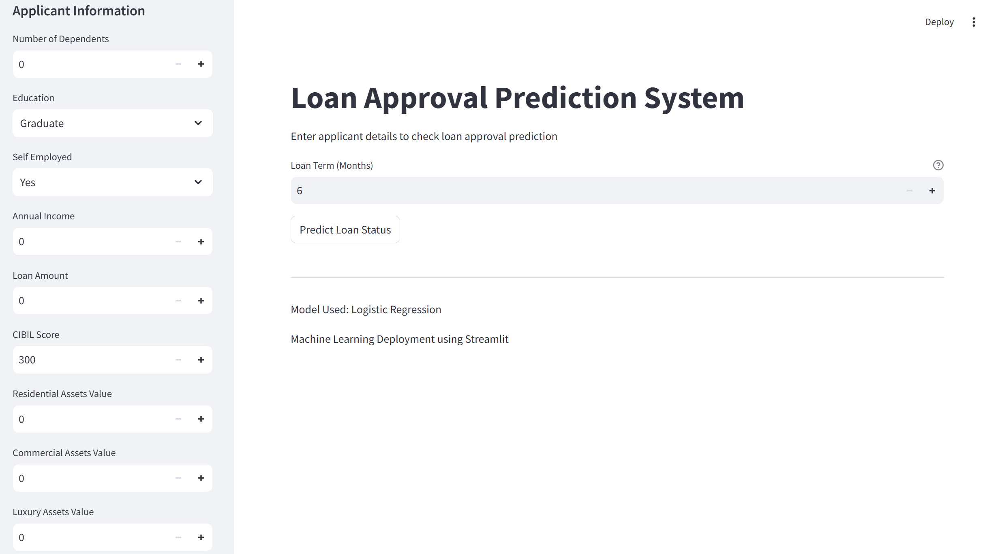
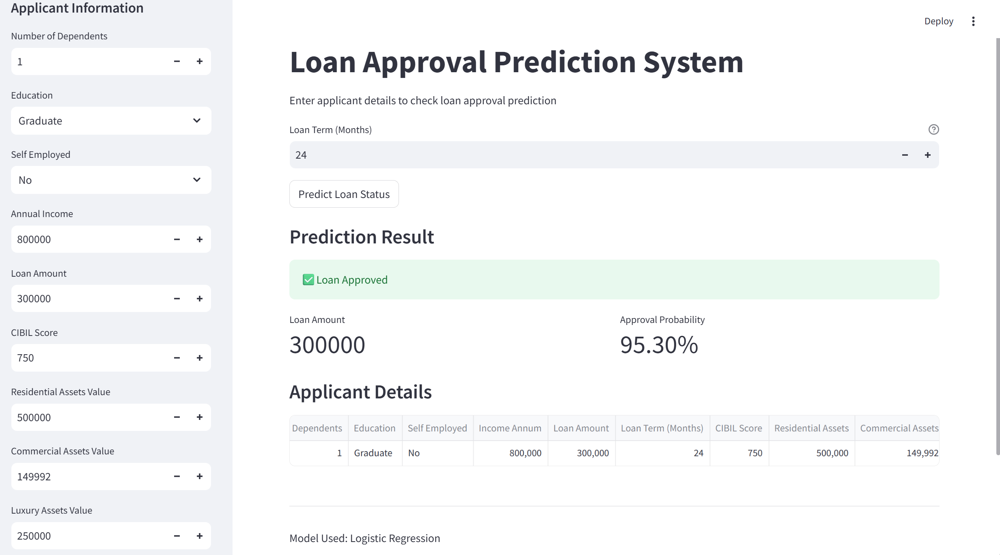
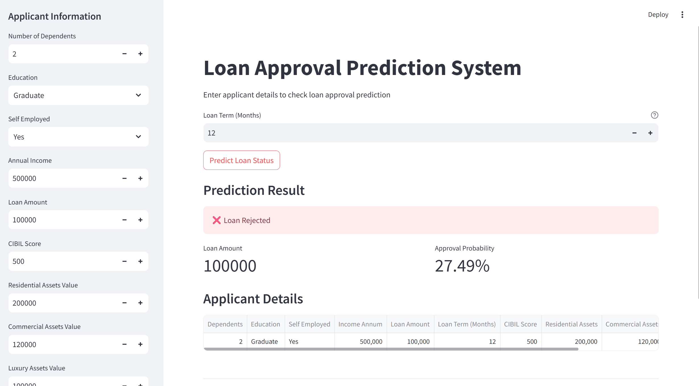

# Loan Approval Prediction using Machine Learning

## Project Overview
This project predicts whether a loan application will be approved or rejected using a Machine Learning model. 

The model is trained on applicant financial and demographic details such as income,assets,loan amount and credit score to determine loan approval status.

A Streamlit web application is developed to allow users to enter applicant details and instantly receive the loan approval prediction.

## Problem Statement

Financial institutions receive thousands of loan applications. Manually analyzing each application is time-consuming and may lead to inconsistent decisions.

The goal of this project is to develop a **machine learning-based loan approval prediction system** that can assist banks and financial institutions in making faster and more accurate decisions.

## Features
- Data preprocessing and feature encoding
- Model training using Python and Scikit-learn
- Loan approval prediction
- Streamlit web application for user interaction
- Data visualization for dataset insights

## Technologies Used
- Python
- Pandas
- NumPy
- Scikit-learn
- Streamlit
- Matplotlib
- Seaborn

## Dataset Features
- Number of Dependents
- Education
- Self Employed
- Annual Income
- Loan Amount
- Loan Term
- CIBIL Score
- Residential Assets Value
- Commercial Assets Value
- Luxury Assets Value
- Bank Asset Value

## Project Workflow

### 1. Data Collection
- Load the loan approval dataset.

### 2. Data Preprocessing
- Handle categorical variables.
- Encode categorical values.
- Perform feature scaling.

### 3. Exploratory Data Analysis (EDA)
- Visualize data using plots and charts.
- Perform correlation analysis to understand feature relationships.

### 4. Model Training
- Train a machine learning model.
- Evaluate model performance and accuracy.

### 5. Model Saving
- Save the trained model using **Pickle** for later use.

### 6. Web Application Development
- Build an interactive UI using **Streamlit**.

### 7. Prediction
- User enters loan applicant details.
- Model predicts the loan approval status.

## Application Interface
The Streamlit application allows users to input applicant details such as:

- Income  
- Loan amount  
- Loan term  
- CIBIL score  
- Asset values  
- Education status  
- Employment status  

After submitting the details, the model predicts whether the loan will be **approved** or **rejected**.

## Model Output
The system provides one of the following predictions:

- Loan Approved  
- Loan Rejected  

This prediction is based on the trained **machine learning model**.

## Application Screenshots

### Input Interface

### Prediction Output - Approved

### Prediction Output - Rejected

